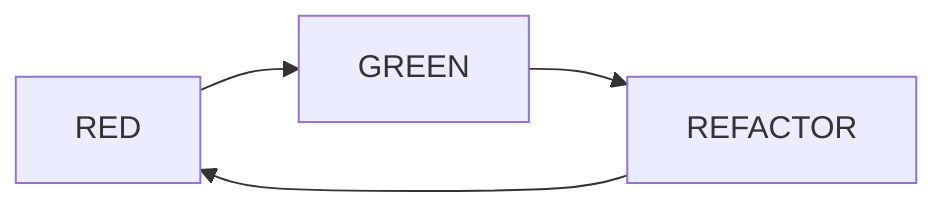

# 🤖 AI Agents 사용 가이드

## 📁 프로젝트 구조

```
front_7th_chapter1-2/
├── .cursor/
│   ├── rules                          # 프로젝트 전체 규칙
│   └── agents/                        # AI Agent 프롬프트
│       ├── README.md                  # Agent 사용 가이드
│       ├── orchestrator.md            # 오케스트레이터 (전체 관리)
│       ├── spec-designer.md           # 명세 작성
│       ├── test-designer.md           # 테스트 설계
│       ├── test-coder.md             # 테스트 코드 작성 (RED)
│       ├── developer.md              # 기능 구현 (GREEN)
│       └── refactorer.md             # 리팩토링 (REFACTOR)
├── docs/
│   ├── testing-guidelines.md         # 테스트 작성 가이드
│   └── specs/                        # 기능 명세 문서
└── src/
    ├── __tests__/                    # 테스트 파일
    └── ...
```

## 🚀 빠른 시작

### 1. 첫 번째 기능 개발

```
@orchestrator

RepeatInfo 타입에 id?: string 필드를 추가하고,
TDD 방식으로 구현해줘.

각 단계마다 승인을 요청해줘.
```

오케스트레이터가 자동으로:

1. 명세 작성 요청
2. 테스트 설계 요청
3. 테스트 코드 작성 (RED)
4. 기능 구현 (GREEN)
5. 리팩토링 (REFACTOR)
6. 각 단계마다 커밋

### 2. 각 단계 결과 확인

각 단계마다 **인간의 검토가 필요**합니다:

- ✋ **명세 검토**: 요구사항과 일치하는지
- ✋ **테스트 설계 검토**: 의미 있는 테스트인지
- ✋ **구현 확인**: 실제로 동작하는지 (`pnpm dev`)
- ✋ **리팩토링 확인**: 개선이 적절한지

### 3. 결과 확인

```bash
# 모든 테스트 통과 확인
pnpm test

# 앱 실행하여 동작 확인
pnpm dev

# Git 히스토리 확인
git log --oneline
# 예상 결과:
# abc123 refactor: RepeatInfo id 필드 리팩토링 (REFACTOR)
# def456 feat: RepeatInfo에 id 필드 추가 (GREEN)
# ghi789 test: RepeatInfo id 필드 테스트 추가 (RED)
```

## 📖 상세 가이드

### Agent 호출 방법

Cursor에서 `@` 기호로 에이전트를 호출할 수 있습니다:

```
@orchestrator     - 전체 TDD 사이클 관리 (지휘자)
@spec-designer    - 명세 작성
@test-designer    - 테스트 설계
@test-coder       - 테스트 코드 작성 (RED)
@developer        - 기능 구현 (GREEN)
@refactorer       - 리팩토링 (REFACTOR)
```

### TDD 사이클



1. **🔴 RED**: 실패하는 테스트 작성

   - 아직 구현되지 않은 기능을 테스트
   - 테스트가 실패하는지 확인
   - 커밋: `test: [기능명] 테스트 추가 (RED)`

2. **🟢 GREEN**: 테스트를 통과시키는 최소 구현

   - 테스트를 통과시키는 코드만 작성
   - 과도한 추상화나 최적화 금지
   - 커밋: `feat: [기능명] 구현 (GREEN)`

3. **🔵 REFACTOR**: 코드 품질 개선
   - 중복 제거, 네이밍 개선, 구조 개선
   - 테스트는 여전히 통과해야 함
   - 커밋: `refactor: [기능명] 리팩토링 (REFACTOR)`

## 💡 베스트 프랙티스

### ✅ DO

1. **작은 단위로 진행**

   ```
   ✅ "RepeatInfo에 id 필드 추가"
   ✅ "반복 일정 생성 유틸 함수 작성"
   ✅ "UI에 반복 옵션 추가"
   ```

2. **각 단계마다 검토**

   - 명세 확인 → 승인
   - 테스트 확인 → 승인
   - 구현 확인 → 승인

3. **자주 커밋**

   - RED, GREEN, REFACTOR 각각 커밋

4. **에이전트 피드백**
   ```
   좋은 테스트야! 하지만 윤년 케이스를 추가해줄래?
   ```

### ❌ DON'T

1. **큰 단위로 진행**

   ```
   ❌ "반복 일정 전체 기능 한 번에 구현"
   ```

2. **단계 건너뛰기**

   ```
   ❌ 테스트 없이 바로 구현
   ```

3. **테스트 수정 (GREEN 단계)**

   ```
   ❌ 구현 단계에서 테스트를 수정하면 안 됨
   ```

4. **과도한 최적화**
   ```
   ❌ "나중에 필요할 것 같아서" 미리 구현
   ```

## 🎯 과제 진행 순서

### Phase 1: 환경 설정 (완료 ✅)

- [x] `.cursor/` 폴더 생성
- [x] 6개 Agent 프롬프트 작성
- [x] 테스트 가이드라인 문서

### Phase 2: 첫 기능 실습

- [ ] RepeatInfo에 id 필드 추가 (연습)
- [ ] TDD 사이클 경험

### Phase 3: 본격적인 기능 개발

- [ ] 반복 일정 생성 유틸 함수
- [ ] UI: 반복 유형 선택
- [ ] 반복 일정 저장 로직
- [ ] 반복 일정 표시 (아이콘)
- [ ] 반복 일정 수정 (단일/전체)
- [ ] 반복 일정 삭제 (단일/전체)

### Phase 4: 리포트 작성

- [ ] `report.md` 심화 과제 작성
- [ ] PR 생성

## 🔧 문제 해결

### 테스트가 통과하지 않을 때

```
@developer

테스트가 실패해. 에러 메시지:
[에러 메시지 붙여넣기]

수정해줄래?
```

### 에이전트가 테스트를 수정했을 때

```
❌ 테스트를 수정하면 안 돼!
원래 테스트로 되돌리고, 구현 코드만 수정해줘.
```

### 명세가 불명확할 때

```
@spec-designer

명세를 다시 확인해줘.
"31일이 없는 달은 건너뛴다"는 정확히 어떤 의미야?
예시를 들어줄래?
```

## 📚 참고 문서

- `.cursor/agents/README.md` - Agent 상세 가이드
- `docs/testing-guidelines.md` - 테스트 작성 규칙
- `.cursor/rules` - 프로젝트 규칙

## 🎓 학습 목표

이 Agent 시스템을 통해:

1. ✅ TDD 사이클에 익숙해지기
2. ✅ AI를 활용한 체계적인 개발 경험
3. ✅ 테스트 주도 개발의 장점 체감
4. ✅ 좋은 테스트 코드 작성법 학습

## 🚀 시작하기

```
@orchestrator

안녕! 반복 일정 기능 개발을 시작하고 싶어.
첫 번째 작업으로 RepeatInfo 타입에 id 필드를 추가하는
작업을 TDD 방식으로 진행해줘.

전체 사이클을 관리하고 각 단계마다 승인을 요청해줘.
```

**Good luck! 🎉**
